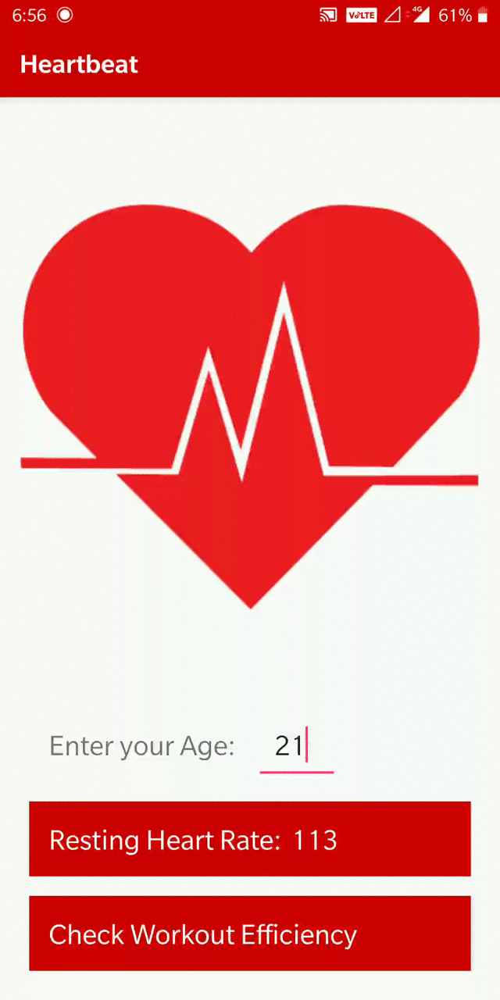

# Heartbeat
Heartbeat is an Android based heart rate monitor which uses the camera and its flash to determine the users heart rate in beats per minute.  
<p align="center">

</p>

## How it works
* The user enters his/her age and then measures his/her resting heart rate which gets stored in the app.  
* After/During a workout, the user measures his/her heart rate again.  
* The app then calculates the user’s maximum heart rate, target heart rate and heart rate reserve.  
* The app also indicates the cardio-zone the user is in which helps the user to determine the efficiency of his/her workout.  
* Thus the user can monitor his/her health with just a basic Android phone and no external devices.  

## Image Processing  
The app uses the phones built-in camera to track color changes on the fingertip that are directly linked to your pulse.
When the index finger is placed on the lens, the camera will pick up very coarse data. 
The app uses the PreviewCallback mechanism to grab the latest image from the preview frame.
It then processes the YUV420SP data and pulls out all the red pixel values.
A big jump to the peak value is seen when the heart beats.  

## Formulae used
Resting Heart Rate (RHR)
* Maximum Heart Rate (MHR):  ```220 - age```  
* Heart Rate Reserve (HRR): ```MHR - RHR```  
* Target Heart Rate (THR): ```THR = ( (MHR - RHR) x %intensity ) + RHR```
(Karnoven's Formula)

## References
* How to process the YUV420SP from camera preview callbacks and pull out all the red pixel values to detect pulses: https://github.com/phishman3579/android-heart-rate-monitor
* Information about the different kinds of heart rates, their ranges and meanings: https://www.livescience.com/42081-normal-heart-rate.html
* How to calculate your Target Heart Rate: https://www.active.com/fitness/articles/how-to-calculate-your-training-heart-rate-zones
* Understanding the different heart rate zones: https://www.mioglobal.com/en-us/calculate-heart-rate-zone.htm
